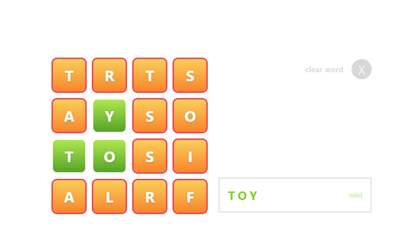

# Letters Game

Welcome to the **Letters Game**! This is a fun and interactive game built with React.



## Live Demo

Check out the live version of the app here: [Letters Game](https://saulr9.github.io/letters-game/)

---

## For Users

### How to Play
1. Visit the live demo link above.
2. Enjoy the game and challenge yourself!

---

## For Developers

### Getting Started

Follow these steps to set up the project locally:

1. **Clone the Repository**  
   ```sh
   git clone https://github.com/saulr9/letters-game.git
   cd letters-game
   ```

2. **Install Dependencies**  
   ```sh
   npm install
   ```

3. **Run the Development Server**  
   ```sh
   npm start
   ```
   Open [http://localhost:3000](http://localhost:3000) to view the app in your browser.

### Build for Production

To create a production build of the app, run:
```sh
npm run build
```

The build artifacts will be stored in the `build/` directory.

### Linting

To check for linting issues, run:
```sh
npm run lint
```

To fix linting issues automatically, run:
```sh
npm run lint:fix
```

---

## Project Structure

```
src/
  components/   # React components
  context/      # Context API for state management
  data/         # Static data
  hooks/        # Custom React hooks
  utils/        # Utility functions
public/         # Static assets
```


